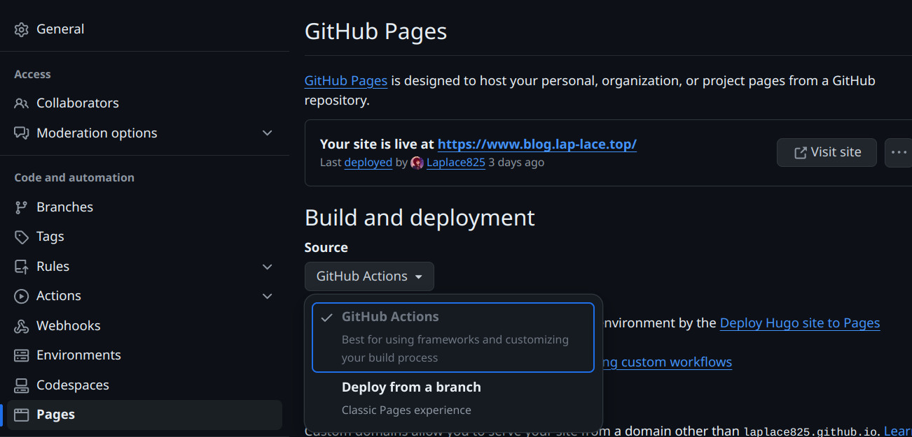

本人也是使用的hugo with github pages，在前期查询了大量的教程，最后终于算是成功了，这里记录一下自己的部署过程。

<!--more-->

##  1.需要的前置安装

包括下列三种：

* Git
* Golang(可不安装，但建议有)
* Hugo

### Git的安装

直接访问[Git - Downloads (git-scm.com)](https://git-scm.com/downloads)安装即可。

### Hugo安装

1. 首先我们使用到choco去安装hugo，先安装hugo，先以管理员权限打开powershell
```cpp
powershell -NoProfile -ExecutionPolicy unrestricted -Command "iex ((new-object net.webclient).DownloadString('https://chocolatey.org/install.ps1'))"
# 设置环境变量
SET PATH=%PATH%;%ALLUSERSPROFILE%\chocolatey\bin
```

2. 然后使用 choco 安装 hugo (同样需要以管理员权限打开 powershell )

```cpp
# 安装可能较慢
choco install hugo-extend
```

3. 在 cmd 或者 powershell 中，我们可以使用以下命令查看 hugo 是否安装成功，如果成功则会显示版本。

```cpp
> hugo version
# cmd显示 hugo v0.119.0-等信息
```

4. 使用 choco 安装golang，在powershell中使用下述命令即可

```cpp
choco install golang
```

### Hugo本地部署

1. 先新建一个文件夹作为博客的工作区。在这个文件夹内打开 Git Bash，输入下述命令，在 site 后面输入自己想创建的博客名称即可，这里以MyNewBlog为例

```cpp
$ hugo new site MyNewBlog
```

2. 然后转到这个文件夹内部

```cpp
$ cd MyNewBlog
```

3. 使用下述命令创建空的 Git 存储库

```cpp
$ git init
```

4. 下一步安装主题，在[themes.gohugo.io](https://themes.gohugo.io/)找到一个对应的主题安装即可，这里给出一般的安装方法(一般而言，每个主题都在 Github 有说明文档，会说明安装方法)

```cpp
$ git submodule add <https> themes/<themename>
# 比如我选择安装hugo-paper主题
# 那么应该输入
$ git submodule add https://github.com/nanxiaobei/hugo-paper themes/paper
```

5. 然后安装完成后，在`themename`文件夹内一般都有`ExampleSite`文件夹，把里面的文件复制到`Blog`根目录下。也有部分主题没有`ExampleSite`文件夹，这时一般可以把`layouts` `static` `images` `i18n`这些文件夹复制到根目录，但还是建议读者能自己分辨文件夹及内部文件所起到的作用。

6. 默认的配置文件一般是`hugo.toml`有部分主题使用的是`config.toml` 或`config.yaml` 具体需要看每个`themename` 文件夹内使用的是什么，把配置文件复制到博客根目录下后，记得删除原来的`hugo.toml`。

7. 然后使用下述命令就可以本地部署了

```cpp
$ hugo server
# 可能有些主题使用到 hugo server -D，建议读者参考安装主题的说明文档
```

8. 从返回到信息可以看到本地网址`http://localhost:<port>/` 粘贴到浏览器就可以看到网页了。

### 将本地Hugo部署到Github Pages上

1. 在 Github 上创建一个新的仓库( Repository )，仓库名称`Repository name` 一栏填写`<username>.github.io` ，其中`<username>` 即读者自己的 Github 用户名。

2. 返回`MyNewBlog` 文件夹，把本地连接到远端

```cpp
$ git remote add origin  git@github.com:<username>/<username>.github.io.git
# username为Github用户名
```

3. 把修改全部添加到本地库并提供提交信息

```cpp
$ git add .
$ git commit -m "msg"
# -m 后面的信息可以随意填写，主要是标记此次更新的内容
```

4. 把分支改成 `main`

```cpp
$ git branch -M main
```

5. 把本地库内容推送到远端

```cpp
$ git push -u origin main
```

6. 进入`https://github.com/<username>/<username>.github.io` (即之前创建的新仓库)，点击`Settings` 然后在左方栏目下点击`Pages` ，在`Build and deployment` 把`Source`改成`Github Actions` 并选择`Hugo` 然后点击下方的`Configure` ，在新界面右侧点击绿色按钮`Commit changes`<br> 

7. 等待一会儿，在`Pages`页面可以看见`Your site is live at ...`，点击`visit site` 即可访问博客。

### 后续更新博客

在本地`content`文件夹中增加`.md`文件，然后执行

```cpp
$ git add .
$ git commit -m "msg"
$ git push -u origin main
```

如果在执行`$ git push -u origin main`时出现了`error: failed to push some refs to 'https://github.com/<username>` 的情况，说明本地库和远程库不一致，可使用下述命令同步本地和远程。

```cpp
$ git pull --rebase origin main
# main也可以是master,取决于本地
```

然后再使用`$ git push -u origin main` 即可。
