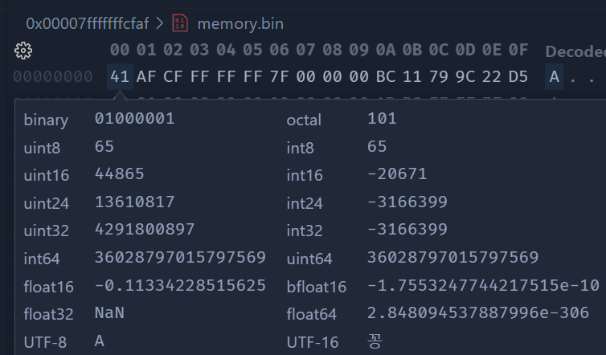

最近尝试`reinterpret_cast`时发现验证了一些计算机组成原理中内存相关的存储方式，不过也只是一些小玩意罢了。

<!--more-->

`C++`代码如下

```cpp
int main()
{
    char cc = 'A';
    int *ccptr = reinterpret_cast<int *>(&cc);
    std::cout << cc << '\n';
    std::cout << *ccptr << '\n';
}
```

在调试查看内存时，验证了小端序的存储方式，可看下图



这里变量`cc`的地址处可以看见存储的字符是`A`，但是当我们打印`*ccptr`时得到的值却是 -**3166399**，从我之前的印象中，我以为这里应该打印出**65**才对，但是其实仔细一想，`int*`指向的应该是一个 32 位 4 字节的数字，而`char`类型只有一个字节，也就是说，$(65)_D$这样一个十进制数只占一个字节，显然少了三个字节，而这少的三个字节，我们通过内存视图容易发现，是由$(41)_H$这个十六进制数之后的`AF CF FF`共同组成。但是如果这个`int`数是$"41AFCFFF"_H$的话，那么无论是`int16`还是`int32`都对不上，所以只能是小端序的存储方式，也即$"FFCFAF41"_H$，而该十六进制以补码形式存储，最高一位做符号位，转换成十进制数也就是-**3166399**，这与`*ccptr`结果一致。
