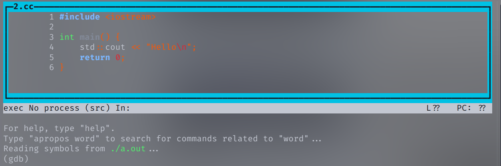
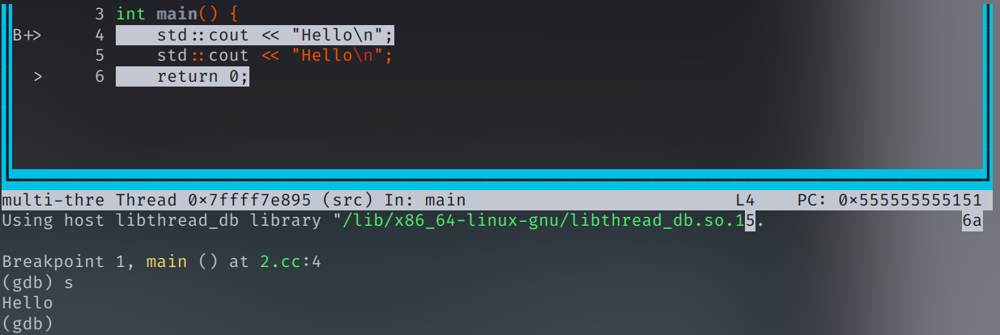
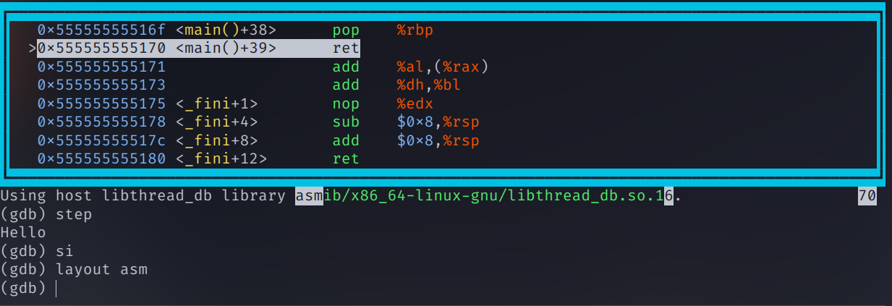
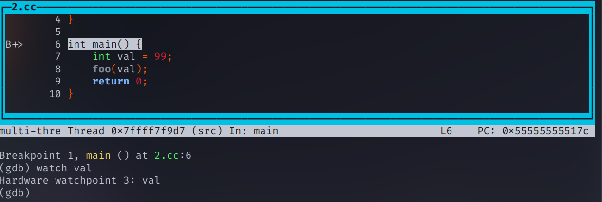
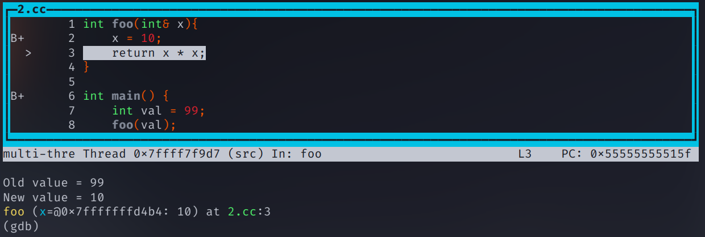
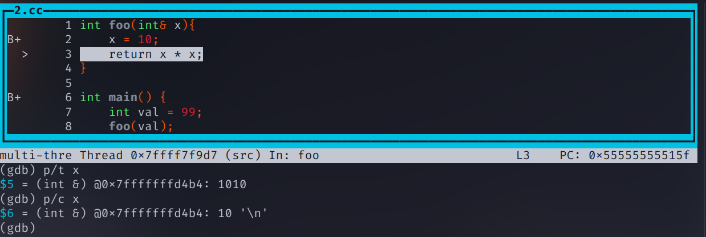
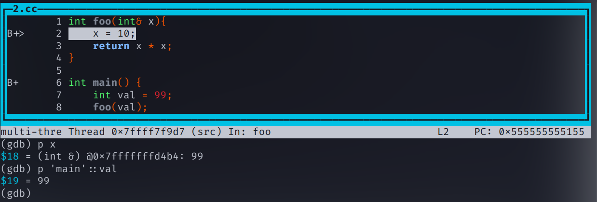
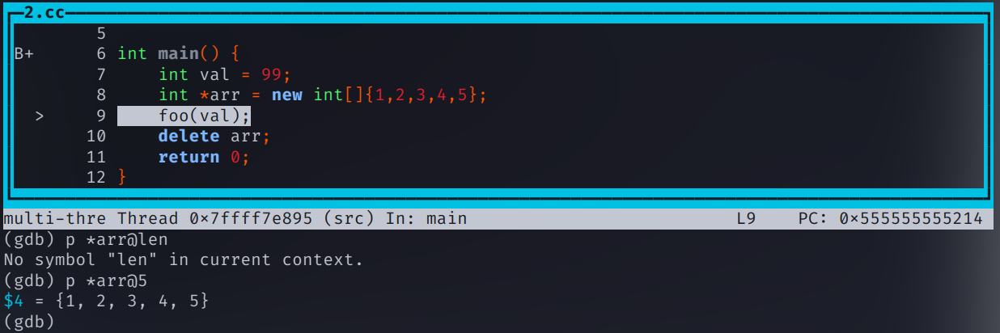
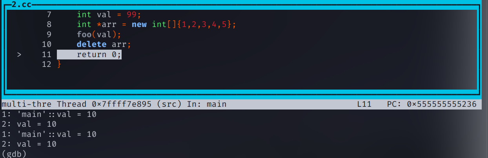

一个简单快速的`GDB`使用入门，直接上手使用进行调试。

<!--more-->
## GCC/G++ 编译文件

在使用`gdb`进行调试之前，需要使用`GCC`的编译器编译可执行文件，我们以`C++`代码为例，使用`g++`进行编译，此时应该带上编译选项`-g`确保生成调试信息，点击此处查看具体信息[GNU/GCC Debugging-Options](https://gcc.gnu.org/onlinedocs/gcc-3.1.1/gcc/Debugging-Options.html#Debugging%20Options)。

```shell
$ g++ main.cc -g -o main
```

---

```cpp
// main.cc
#include <iostream>

int main() {
    std::cout << "Hello\n";
    return 0;
}
```

---
## GDB Text User Interface (TUI)
其实`gdb`也是有UI的，一种终端接口，直接在终端中显示源文件、程序输出、程序寄存器等。点击此处查阅文档[GDB Text User Interface](https://sourceware.org/gdb/current/onlinedocs/gdb.html/TUI.html)。在使用时`gdb`，添加上选项`-tui`即可。如果直接使用`gdb execution_file`，那么也可以输入`tui enable`切换进入`tui`模式。
```shell
$ gdb main -tui
```

---

## 开始调试
如果你正确使用了`g++`的`-g`选项，那么你应该可以在`gdb`打开后看见源代码在上方，命令窗口在下方。如下图，颜色不同仅仅是终端配置区别。这里我没有指定输出的可执行文件名，所以是`a.out`。


---

### 打上断点
我们可以看见各代码的行数，在`gdb`中，使用`break`，或简单地使用`b`打断点，例如我们在`main`函数处打断点则会在该函数的下面一行添加一个断点。我们也可以用`delete`或者`clear`清除断点，前者用于指定某个断点，后者则全部清空。
```shell
$ b main
# or you can also specific lines
$ b 4
```

### 运行
使用`run`或者`r`，将直接运行至当前的第一个断点处，此时可以继续使用`step`或者`s`步过，也可以使用`stepi`或者`si`步入。可以看见直接输入`s`后代码框左边的箭头`>`指向了`return 0`，并且在命令行看见了运行结果。
此时当我们输入`si`的话，则需要`layout asm`查看汇编，因为这时候步入到主函数返回。我们看见当前的汇编恰好对应`ret`。


---

### 监视变量

现在我们修改一下源代码，如下并重新编译调试。
```cpp
// main.cc
int foo(int& x){
     x = 10;
     return x * x; 
}

int main(){
	int val = 90;
    foo(val);
    return 0;
}
```

我们使用`b main`，`b foo`在两个函数的位置打上断点，通过`watch`监视变量。此时则需要先`run`程序，让程序走到需要监视的变量被初始化的作用域，才能成功监视。我们先`r`。然后再`watch val`。可以看见我们成功停在了`main`函数，同时也成功`watch`了`val`这个变量。


---

### 打印变量值

我们再不断`s`，直到程序断在`foo`函数——由于我们在`foo`打了断点，所以`s`不会直接步过`foo`，当我们经过了`x = 10`的赋值语句，此时命令行会提醒我们`val`的值变化。


我们也可以使用`print`或者`p`打印`x`，即`p x`，此时的作用域下只能打印`x`。也可以通过`p/x`指定打印的格式，例如`p/x`就是按照十六进制打印。`p/x x`或`p/t x`。如果要打印变量地址的话，则`p &x`即可，当然，由于我们的程序中`x`是左值引用，所以`p x`的时候，就会显示出其指向的地址，我们的程序是`0x7fffffffd4b4`。也可以用`p *0x7fffffffd4b4`打印出该地址的值。
+ x 按十六进制格式显示变量。
+ d 按十进制格式显示变量。
+ u 按十六进制格式显示无符号整型。
+ o 按八进制格式显示变量。
+ t 按二进制格式显示变量。
+ a 按十六进制格式显示变量。
+ c 按字符格式显示变量。
+ f 按浮点数格式显示变量。


---

大家应该察觉到了，当我们目前在`foo`函数内时，`p val`是无法打印出`main`函数内的值的，此时应该使用`p 'main'::val`进行打印。如果你有多个文件，也可以通过`p 'file2.cc::value'`打印`file2.cc`当中的某个值。这个也适用于各种打印方法，比如`watch`。


对于数组类型，我们需要通过`p *array@len`进行打印，其中`len`是指定的个数。例如我们将`arr`的前5个元素打印出来`p *arr@5`。


### 自动显示变量
我们每次都使用`p`来显示变量太麻烦了，使用`watch`的话也只能在变量改变的时候显示，在各种`ide`里调试的时候可以实时显示当前的每一个变量，太酷了😎，其实我们也可以用`display`来监视，在该变量存在的作用域内，每次操作都会打印一次被`display`的变量。


## 退出调试
使用`q`然后`y`退出

## `Python`自动化的`GDB`脚本
我们可以直接使用`python`编写`gdb`脚本，让我们每次直接运行该脚本，免去调试时重复输入的痛苦😻。例如我们使用`gdb -x debug.py -tui`进行调试，会自动帮我们执行这些指令。点击这里查看[GDB Python API](https://sourceware.org/gdb/current/onlinedocs/gdb.html/Python-API.html#Python-API)
```python
# debug.py
import gdb

gdb.execute("file ./a.out")
gdb.execute("b main" )
gdb.execute("r")
gdb.execute("display 'main'::val")
```

## 一点启示
如果我们可以自动根据当前作用域`display`所有变量并绘制一份`UI`······
