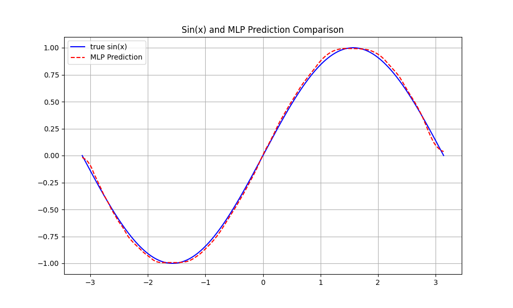
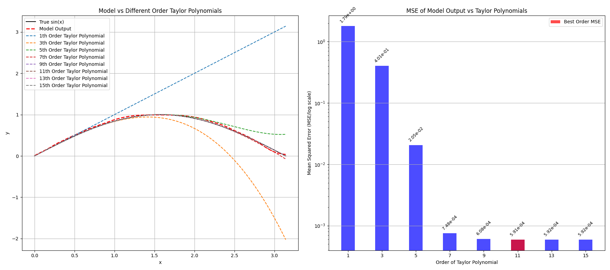

似乎上过很多和深度学习(DL)打过交道的课, 可是印象里居然完全不知道DL在干什么.
就像~~魔法一样~~完全不可解释一样, 反正就是这样的模型可以达成这样的效果, 那我问你, why baby why? 不过DL的可解释性依然是一个很大的课题, **我并不能真正地讲清楚, 也必然有很多误解**, ~~也许没人能讲清楚(笑)~~,
只是突然意识到, DL究竟在干什么, 也只是我自己的理解吧.

<!--more-->

## 所以, DL要干什么

我们可能都知道DL中, 搭一个某某模型, 设计一个某某损失函数, 用一个某某优化器...之后就是反向传播. 这个过程很玄幻, 凭什么搭几层卷积, 用一个什么激活函数就能判断数字了?
为什么我随随便便搞一堆权重矩阵然后同样Back Propagation就一点用都没有🤯?

## 假设

:::note[So What?]
**我提出一个假设, DL通过各种操作希望拟合一个十分复杂的函数**.
:::

- 各种操作: 卷积, 池化, 注意力, ReLU ... Whatever, 就是各种常见的搭模型用的方法
- 一个十分复杂的函数: 几乎难以被数学表达的复杂函数, 本质上是复杂映射 or 变换.

我们举个例子吧, 为了保证简单, 就用图像分类好了.
我们希望构造这样一个映射 $\mathcal{F}$, 它以图像作为输入, 以图像的类别作为输出.

$$
  \mathcal{F}: image \rightarrow class
$$

这个函数是否复杂?
当然, 因为我们几乎不可能第一时间想到如何写个函数表达式, 也就是无解析形式.
那我们怎么能得到一个映射, 来拟合出这样的函数? 或者用更DL的语言, 
**我们该构造一个什么模型, 来拟合这样一个复杂函数**?

### 建模image

为了更好地将该理论推广到一切分类问题, 我们将 $image$ 设为 $\boldsymbol{x}$,
这是一个多维向量, 因为图像可能有多个通道, 还可以有额外的信息, 我们将这些建模为数值(比如tokenizer). 

### 建模class

再来思考 $class$, 每个类别本身都是离散的, 他们没有相互影响, 所以我们肯定能为每个类别编码一个数字, 例如猫狗分类, 那🐱是0, 🐶是1, 显而易见.
那么我们有两种思路, 一种是让 $\mathcal{F}$ 直接输出这个编码的数字; 另一种则是引入概率论的观点, 让 $\mathcal{F}$ 输出某个类别的概率. 显然, 后者给了我们更多信息,
我们还有更多可以引入的方法, 而且每次选择概率最大的类别输出就变成前者了, 那我们就采用后者吧. 

此时, **我们的问题变成了如何拟合一个复杂的且甚至难以预判的拟合概率分布问题**.
在这之前, 如果我们想分类男女怎么办? 我们统计男女的身高, 体重, 体脂率等等"指标",
并建模成数值得到了一堆 $\boldsymbol{x}$, 然后我们也许假设这些指标对男女性别是独立的,
那么用贝叶斯公式, 我们也许就解决了一个男女性别分类的问题, 即提供我一些"指标",
可以根据这些指标经过 $\mathcal{F}$ 得到两种性别的概率.

然而, DL解决的问题复杂的多, 甚至根本无法统计概率, 比如猫狗的图片, 我们只有一堆 rgb 值(假设三通道), 这些值怎么统计概率? 比如语言, 我想把中文自动翻译成英语, 倒是能统计概率, 但是难道要把一个词之后可能跟着的所有词的概率也都统计一遍? 我相信世界上最强的计算机也算不完, 何况语言是会变的.

## 试试拟合函数?

即然DL其实是拟合映射, 那么对于一般的可解析的函数, DL都应该有办法进行拟合, 那不妨试试看.

### 正弦

我试着用简单的MLP来拟合 $\sin{x}$, 我只用 ReLU 堆了个模型, 
拟合 $[-\pi, \pi]$ 的 $\sin{x}$. 模型结构如下, 一共6层, 5层都是 Linear + Dropout + ReLU, 最后一层fc.

实际上MLP不引入非线性激活函数的话, 那么 $\hat{y}=W\boldsymbol{x}+\hat{b}$ 多层堆叠就像 $W^{k}\times \boldsymbol{x}$, 如果我们希望与 Taylor 级数做比较的话, 只能比较一次项与零次项, 而引入非线性激活函数后 ReLU 则可以拟合, 可以理解为一层ReLU由不同权重可以拟合任意分段线性函数,
例如你只需要一个线性层 + ReLU 再全连接就能拟合任意$\sum_{i}(a_{i}x^{i}+b_{i})$, 可以调整第一个 Linear 的参数个数, 能发现随参数变多, 实际上有更多小线段.

我生成了10000个 $[-\pi, \pi]$ 之间的样本点作为测试数据训练, 当模型与真实值差小于 $5 \times 10^{-4}$ 时就停止了.

### 看看结果

首先是我们对 $\sin{x}$ 的拟合, 
可以看见拟合效果好像还行, 调调参数或者增添模型层数或许会更好.

然后我选择计算带 ReLU 版本的模型与 $n$ 项泰勒级数之间的MSE. 目前的精度基本和第11项泰勒级数最接近, 再往后的差值基本上就固定在 $5.92\times 10^{-4}$ 了.

## 所以为什么用交叉熵

众所周知, 交叉熵在分类任务中进行使用, Transformer Decoder 结构也是采用交叉熵. 为什么就是交叉熵好用呢? 交叉熵 $H(P, Q)$ 是使用一个分布 $Q$ 来编码真实分布 $P$ 所需的信息量, 最小化交叉熵就是让我们的分类模型以最小的信息量编码 $P$, 好像也说的过去, 可是为啥有的地方又在用这个 KL 散度? 为什么不也用交叉熵呢?

实际上, 由上述对 DL 的定义, 我们应该找到一个概率分布作为映射, KL 散度更合理. 但是对于分类任务来说, 每个类的熵 $H(P)$ 是固定的, 此时最小化 KL 散度就是最小化交叉熵. 然而对于某些算法来说, $H(P)$ 不是固定的. 例如 t-SNE 最后通过最小化高维数据点分布P和低维数据点分布Q的 KL 散度来保持降维后分布的一致性, 因为高维数据点的高斯分布(或t分布)假设采用了超参数 perplexity, $H(P)$ 不是固定的.

$$
H(P, Q) = H(P) + D_{KL}(P || Q)
$$

对于 Transformer Decoder 来说, 本质上是一个巨大的 token 分类器, 自然可以用交叉熵, 因为你的 token 词表已经是确定的, 比如用 bpe 得到了 4000 个 token 的词表, 每个 token 都有单独且不变的编号.

## 所以为什么用MSE

实际上 $\sin{x}$ 的例子也是 MSE, 所以为什么呢? 因为对于回归问题, 我们希望得到的映射本身往往是连续的, 而不是离散概率分布(例如分类的多标签), 此时衡量模型就应该采用预测 $\hat{y}=\mathcal{F}(\boldsymbol{x})$ 与真实 $y$ 之间的 "距离", 这也就引入了 $L$ 范数. 当然我们也可以用更高级的数学知识, 非欧几何 (ps. 不太会这个) 等概念来表述一个 "距离".

## 谈谈结论吧

DL 的目标是找到一个复杂 $\mathcal{F}$, 让它对于特定任务的输入, 映射为特定的输出, 这个 $\mathcal{F}$ 通常相当复杂, 我们几乎不知道是什么或者应该是什么, 有时候只能猜测它可能具有某种性质.
