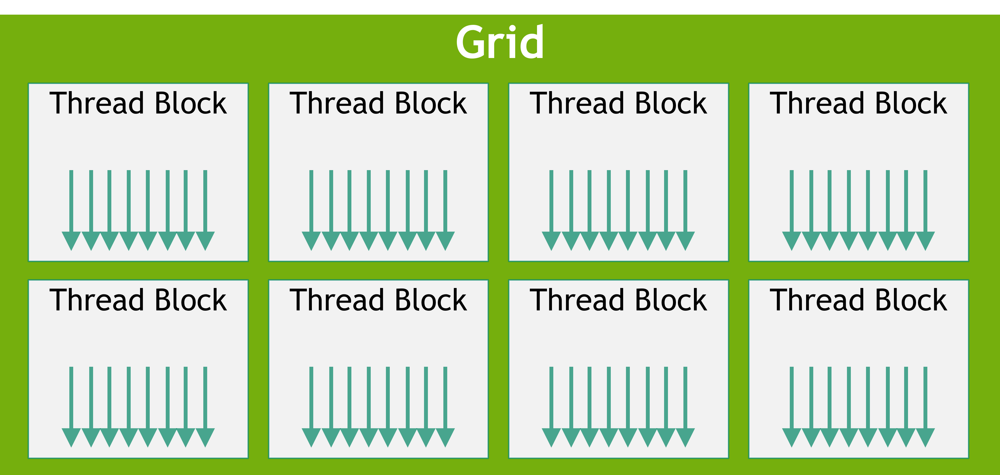

~~一文读懂 NVIDIA GPU 与 CUDA 编程结构概念~~.

<!--more-->

## NVIDIA GPU 结构

一个典型的 NVIDIA GPU 可以被看作多个 SM (流式多处理器) 与 HBM (GPU 的全局显存, 类似内存) 共同组成的结构. 所有的 SM 也同时共享一块 L2 Cache. 


每个 SM 内部有多个 Block (sub core), 多个 Block (同一 SM) 之间共享 L1 Cache. 而每个 Block 内部共享 L0 Cache.
每个 Block 内部包括 cuda core, tensor core 等运算单元, 这些运算单元通过由 GPU 决定使用 SIMD 指令, 单个 Block 的线程数由 Warp 决定, 通常一个 Block 同时激活一个 Warp, 例如下面的 Warp Scheduler 为 32 thread per clk, 表明该 Block 每个周期最多同时启动 32 个线程. 而下面这个 SM 包括 4 个 Block, 因此最多拥有 4 x 32 = 128 个线程.


这里 V100 的 Block 结构可以看出, 上面的 INT32/FP32/FP64 等 cuda core 都是 SIMD 指令单元, 
同时还应具有 Load/Store 单元用于存取数. 每个 Warp 本质上是一堆寄存器, 这里的 sub-core 指代的是 Block. 
而每个 Warp 支持 32 个线程的本质是因为单个 Warp 一共只有 32 个 Registers 列. 然而, 对于第一个 Block 来说,
包括了 warp 0, warp 4, warp 8, ... , warp 60 等 (其他 Block 同理), 这里就是 Warp Selector (or 上面的 Warp Scheduler) 起作用了, 每次只能从这些 warps 中选择一个 warp 分配执行, 实际上可以做延迟隐藏或流水线调度(if wrong please figure out), 尽可能提高每个 Block 的使用率, 然而这是对于 GPU 硬件来说的, 但是必须指出, 虽然一个 Block 有多个 warp, 但是同时只有一个 warp 被执行.


我们可以计算出整个 V100 有 80[SMs] x 4[Blocks per SM] x 16[Warps per Block] x 32[Threads per Warp] = 163840 个 cuda threads. 但同时最多有 80 x 4 x 32 = 10240 个线程被启动并执行. 一共有 80 x 4 x 16 = 5120 个 warps, 但是同时最多有 5120/16 (or 80 x 4) 个 warp 被启动.

## CUDA

CUDA 是典型的 SPMD 模型, 由多个线程执行相同的程序, 而处理的数据不同, 大部分概念都是逻辑概念, 不一定直接和硬件概念绑定. 
NVIDIA GPU 会进行动态调度, 将 CUDA 分配出超过 GPU 的线程分配给空闲 SM. 例如在 CUDA 中采用了 8 个 Thread Blocks, 而硬件只有 2 个 SM, 那么所有的 Thread Blocks 可能会交替分发给这两个 SM, 对于 4 个 SM 同理.


### Kernels 核函数

CUDA 的所有 GPU 端 (device 端) 的函数被称为核函数. 每个 Kernel 由 GPU 执行. 
CUDA 内建了变量 `threadIdx` 代表执行时的线程号, 在 CUDA 中, 线程号是多维的, 最多为 3 维.
例如下面的 Kernel 进行两个 N 维矩阵求和, 启动一个 Thread Block, 该 Thread Block 中包括二维 NxN 的线程.

```cpp
// Kernel definition
__global__ void mat_add(float A[N][N], float B[N][N],
                       float C[N][N]) {
    int i = threadIdx.x;
    int j = threadIdx.y;
    C[i][j] = A[i][j] + B[i][j];
}

int main() {
    ...
    // Kernel invocation with one block of N * N * 1 threads
    int numBlocks = 1;
    dim3 threadsPerBlock(N, N);
    mat_add<<<numBlocks, threadsPerBlock>>>(A, B, C);
    ...
}

```

### Grid 网格

CUDA 编程模型中, 每个网格代表了一组多维的 Thread Blocks. 一个 Grid 内的线程总数可以远大于硬件的总线程数,
GPU 会进行动态调度.



依然是对于二维矩阵的求和, 想象一下按照 Thread Block 大小将整个矩阵划分为不同的 16x16 的小块, 每个小块对应一个
Thread Block, 整个矩阵就是一个 Grid, 此时 CUDA 使用内建的 `blockIdx` 和 `blockDim` 变量, 分别表明划分的每个小块的 id, 以及 Thread Block 的 "维度" (例如这个例子中就是 16x16). 那么可以通过 `blockIdx` 和 `blockDim` 获取到分块的矩阵的行列号.

```cpp
// Kernel definition
__global__ void mat_add(float A[N][N], float B[N][N],
float C[N][N]) {
    int i = blockIdx.x * blockDim.x + threadIdx.x;
    int j = blockIdx.y * blockDim.y + threadIdx.y;
    if (i < N && j < N)
        C[i][j] = A[i][j] + B[i][j];
}

int main() {
    ...
    // Kernel invocation
    dim3 threadsPerBlock(16, 16);
    dim3 numBlocks(N / threadsPerBlock.x, N / threadsPerBlock.y);
    mat_add<<<numBlocks, threadsPerBlock>>>(A, B, C);
    ...
}
```

### Memory 分配

每个 Thread 拥有自己的 Private Local Memory (Warp Registers), 而同一 Thread Block 中所有 Thread 可以共享 L1 Cache 和 Shared Memory. 在 CUDA 中, 通过 `__shared__` 即可在 L1 Cache 和 Shared Memory (严谨一些实际是 SRAM) 分配共享 Memory. 当想分配的 Memory 超过了 SRAM 容量, 程序可以正常运行, 但是会使用 HBM.

可以采用下面的方式计算一个 SM 可以容纳多少 Block, 这需要结合 Kernel 进行检查.

```cpp
__global__ void kernel() {
    __shared__ int data[64];  // every block allocate 64 integer shared mem
    data[threadIdx.x] = threadIdx.x;
    __syncthreads(); // like a barrier
}

const int blockSize = 256;
int maxBlocks = -1;
cudaOccupancyMaxActiveBlocksPerMultiprocessor(&maxBlocks, kernel, blockSize, 0);
if (maxBlocks == 0) {
    printf("Too much shared memory requested. Kernel will not launch efficiently.\n");
}
```

也可以分配动态共享存储 (注意这不是动态扩容), 当启动某个 Kernel 时, 由 Kernel 启动时的参数确定.

```cpp
__global__ void kernel(int N) {
    extern __shared__ int sdata[];  // the size is determined when launch

    int tid = threadIdx.x;
    if (tid < N) {
        sdata[tid] = tid;
    }
    __syncthreads();
}

int N = 256;
size_t smemSize = N * sizeof(int); // specify shared memory size
kernel<<<1, N, smemSize>>>(N);
```
