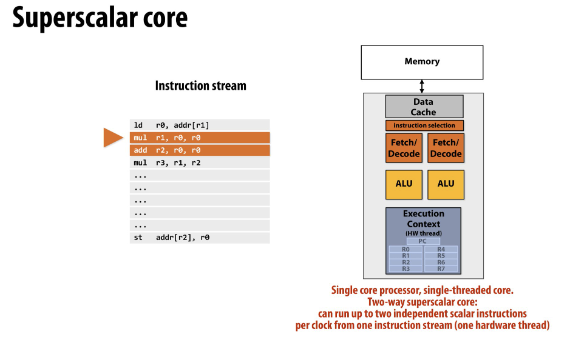
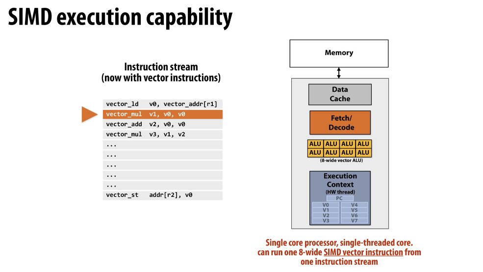
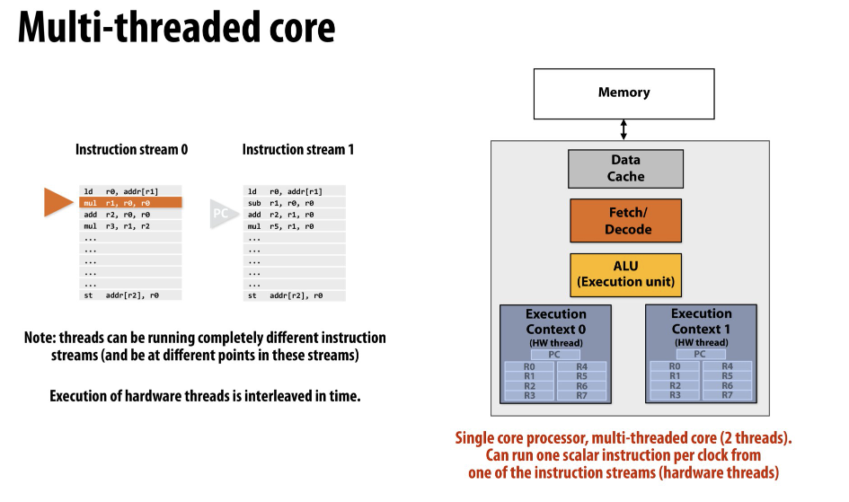

如题所述, 这么多的概念指代的是什么? 区别呢?

<!--more-->

## 关于图片

所有图片均取自 [Standford CS149 slide](https://gfxcourses.stanford.edu/cs149/fall21).
如有兴趣, 可以直接看这门课.

## 超标量

**指令级并行**, IPC 大于 1 . 简单来说, 
就是一个 CPU core 中有多个 ALU 可以同时使用, 配套的还需要多个取指、解码单元.

下图中采用两个 ALU 配套两个取指解码单元, 就实现了一次性运行两条指令.
对于两条连续的数据相关指令, 例如连续运行 `mul r1, r0, r0`, 
由于同时采用 ALU 会出现 `r1` 对应 cache line 访问冲突, 所以无法同时执行.
这里其实解释了为什么是 "independent scalar instructions", 我们可以构造例如 `mul r2, r1, r0` 在 `mul r1, r0, r0`
之后执行, 显然, 这两条指令不能同时运行.

## SIMD

**单指令多数据流**. 实际上就是一条指令能算好几个数.
思想很简单, 但是对于一些需要大量计算连续数据 (向量, 矩阵) 的程序就是碾压级的加速,
毕竟 AVX512 一个 cycle 算 512 bit, 而普通情况下一个 cycle 的在 pipeline 下的吞吐量可能也只能到一个 cycle 算三数据指令 `mul`.

从硬件上看, 实际上是增加了 vector ALU . 在一些 Intel Chip 上, 可以看看有几个 FMA, 
对应了每个 CPU core 有几个 SIMD 执行单元. 值得注意的是, 实践当中大量使用 SIMD 时, Intel Chip 的频率似乎会比基频更低,
这可能与 FMA 的频率有关? 但是吞吐量的提升依然是巨大的.

## 多线程

**线程级并行**, 我们以 SMT (Intel Hyper-Threading) 为例.
实际上, 一个 CPU core 内依然只有一个 ALU 和一个取指解码单元, 
也就是一次性最多运行一条指令 (IPC=1) . 然而, 基于一个共同的事实, 
内存带宽、I/O延迟、中断等等都可能导致当前指令流等待, 可以额外用一组寄存器保存当前的执行上下文 (比如断点位置等),
然后切换上下文运行另一个指令流以达成 pipeline 充分利用等待时间的效果.
这是非常有效的, 因为支持 Hyper-Threading 的 OS 会尽可能将大概率无关的任务往一个核上进行分配,
例如两个进程. 而对于单进程多线程编程来说, 如果本身是计算密集型并且还远不够 memory bound 的情况下,
那么增加 exectuion context 的效果就不大了.

但是, 我们还必须区分两个概念: 
- **hardware thread**: 硬件支持的线程, 实际上和 CPU core 一致.
- **virtual thread**: 虚拟的逻辑线程, 一般是利用 Hyper-Threading 将线程数倍增.

## 多核

**处理器级**, 在多核的层面上, 往往是多进程并行 (当然也可以多线程).
有多少个 CPU core 就有多少个 hardware thread, 如果从任务的角度来说, 就是至少有 8 个完全不相关的任务可以完全并行执行.

## 总结

当前的 CPU 架构一般是多个核, 每个核内采用了超标量架构, 集成 SIMD 执行单元, 同时增加 exectuion context 实现 Hyper-Threading.
