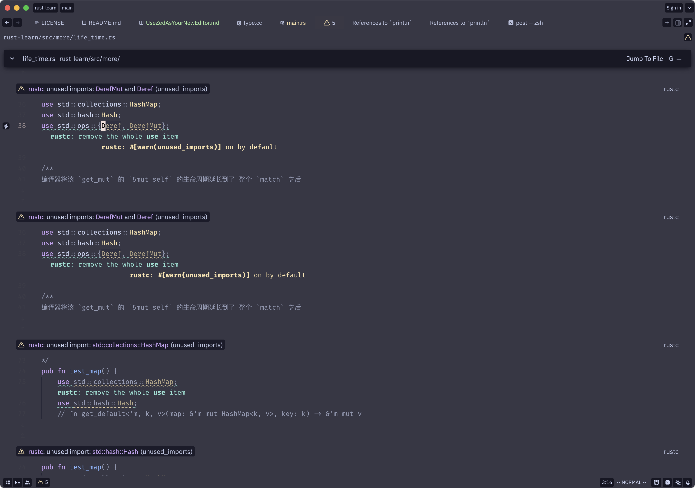
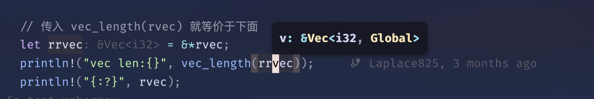
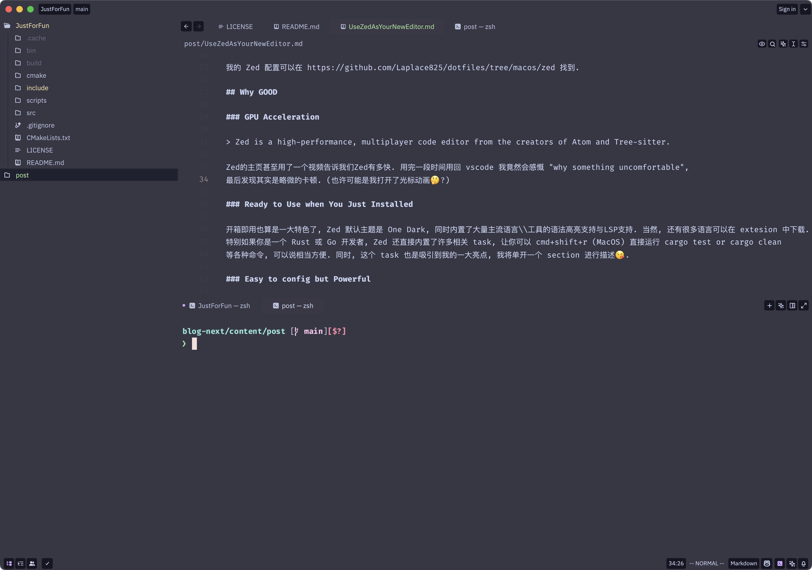

突然发现自己用的工具越来越多被 Rust 替代😂, 不得不说很多 Rust 写的工具真的好用.  
ls &#8594; eza,  
vscode &#8594; zed,  
latex/word ? &#8594; typst,  
grep &#8594; rg,  
find &#8594; fd.  
完全习惯了使用 yazi 作为纯 tui 文件管理器.

<!--more-->

## My configure

我的 Zed 配置可以在 https://github.com/Laplace825/dotfiles/tree/macos/zed 找到.

## GPU Acceleration

> Zed is a high-performance, multiplayer code editor from the creators of Atom and Tree-sitter.

Zed的主页甚至用了一个视频告诉我们Zed有多快. 用完一段时间用回 vscode 我竟然会感慨 "why something uncomfortable",
最后发现其实是略微的卡顿. (也许可能是我打开了光标动画🤔?)

### Ready to Use when You Just Installed

开箱即用也算是一大特色了, Zed 默认主题是 One Dark, 同时内置了大量主流语言\\工具的语法高亮支持与LSP支持. 当然, 还有很多语言可以在 extesion 中下载.
特别如果你是一个 Rust 或 Go 开发者, Zed 还直接内置了许多相关 task, 让你可以 cmd+shift+r (MacOS) 直接运行 cargo test or cargo clean
等各种命令, 可以说相当方便. 同时, 这个 task 也是吸引到我的一大亮点, 我将单开一个 section 进行描述😘.

Zed 还内置集成 git 和 AI assistant, 可以自行设置调用模型 api 或直接使用 Github Copilot 等.

- **优秀的代码跳转** Zed 可以在一个屏幕内支持多个代码预览, 这里用一个查找所有 warning 为例. Zed 会另开一个 buffer 文件显示所有相关引用,
我们可以使用光标直接在该文件上对所有相关代码进行更改, 或者按下 `g space` 跳转到该文件.



- **自动函数签名显示** Zed 可以设置自动显示签名, 这对于开发十分有用, 虽然我们也可以把光标移到函数上等待显示, 或者 vim mode `K` 查看函数签名, 
但自动签名显示有时候确实 save your life. 这个功能并非默认开启, 如果不需要自动显示, 也可以用 `cmd+i` (MacOS) 显示签名.



## Easy to config but Powerful

### settings.json

Zed 的配置是通过 `json` 来进行的, 不像其他 GUI 配置为主, Zed 倾向于以配置文件的形式. Zed 的配置文件
同时还支持提示, 加上本身拥有一个清晰的文档, 配置可以说相当直观方便, 适合不喜欢在一大堆 GUI 描述中找那几个自己需求的同学.
下面就是我自己的 `settings.json` 部分配置, 个人感觉清晰明了. 这里推荐一个仓库 https://github.com/jellydn/zed-101-setup

```json
{
    "assistant": {
        "default_model": {
            "provider": "copilot_chat",
            "model": "o3-mini"
        },
        "version": "2"
    },
    "ui_font_size": 14,
    "tab_size": 4,
    "buffer_font_size": 14,
    "buffer_font_family": "FiraCode Nerd Font Mono",
    "theme": {
        "mode": "system",
        "light": "Catppuccin Latte (Blur)",
        "dark": "Catppuccin Mocha (Blur)"
    },
    "file_types": {
        "CMake": ["CMake*"]
    },
    "vim_mode": true,
    "scrollbar": {
        "show": "never"
    },
    "indent_guides": {
        "enabled": true
    },
}
```

### keymap.json

终于算是重头戏了, Zed 的 keymap 直觉是 "what key => do something",
而许多 GUI 式配置则是 "do something => what key". 可能我们初看感觉不到什么区别, 然而实际上遇到
一些 GUI 没有预制的 "do something" 时, 配置就犯了难.  Zed 这样的配置更加符合快捷键直觉, 毕竟用快捷键就是
记着某某是什么功能.

- **上下文支持** Zed 中的快捷键设置可以拥有上下文, 直接避免了各种可能导致全局配置造成键位冲突. 例如我必用的 vim mode
在 Zed 中就可以通过上下文单独设置

- **ProjectPanel** 项目栏, 或者我们用的 vscode 默认 open folder 可以在 左侧看见的工作区, or file tree. (其实就是那种左侧显示
当前路径一堆文件的工具栏.)  Zed 的上下文支持直接让我们可以针对这个工具栏单独设置各种按键映射, 甚至包括配合 vim-mode 使用 `ctrl-h`
`ctrl-j` 等在当前打开文件和项目栏跳动光标. 

```json
{
    {
        "context": "ProjectPanel && not_editing",
        "bindings": {
            "a": "project_panel::NewFile",
            "r": "project_panel::Rename",
            "l": "project_panel::OpenPermanent",
            "ctrl-d": "project_panel::SelectNextDirectory",
            "ctrl-u": "project_panel::SelectPrevDirectory",
            "ctrl-h": ["workspace::ActivatePaneInDirection", "Left"],
            "ctrl-l": ["workspace::ActivatePaneInDirection", "Right"],
            "space d p": "project_panel::RemoveFromProject",
            "space a p": "workspace::AddFolderToProject"
        }
    },
    {
        "context": "Editor && vim_mode == normal && !VimWaiting && !menu",
        "bindings": {
            // put key-bindings here if you want them to work only in normal mode
            // Ctrl hjkl to move between panes
            "ctrl-h": ["workspace::ActivatePaneInDirection", "Left"],
            "ctrl-l": ["workspace::ActivatePaneInDirection", "Right"],
            "ctrl-k": ["workspace::ActivatePaneInDirection", "Up"],
            "ctrl-j": ["workspace::ActivatePaneInDirection", "Down"],
    }
}
```

- **多项目管理**  这应该是吸引到我的一大亮点. 你可以直接在侧边项目栏中添加多个不同的项目文件夹, 根据你当前所打开的文件路径,
Zed 新建终端的路径也会改为该项目的根目录. 加上良好的上下文按键映射, 我可以很轻松地为项目栏添加一个添加项目和移除项目的快捷键, 例如
`space a p`, `space d p`. 下图左侧就是两个截然不同的项目, 而我新建终端的名字包括根目录也会随着打开文件的不同而新建.



- **快捷键组合** Zed 内置了很多快捷键功能, 但是内置再多也不一定能满足需求, 幸运的是, Zed 支持将快捷键组合起来并映射为单一快捷键.
例如我比较喜欢将 `alt+{1,2,3}` 映射为三种打开终端的方式 (居中, 下半屏, 右半屏), Zed 只内置了居中和下半屏打开的功能, 我如何设置右半屏打开呢?
实际上就是右侧 `split` 出一个 pane (右侧分屏), 然后在该 pane 居中打开一个终端.

```json
{
    {
        "context": "Editor && vim_mode == normal && !VimWaiting && !menu",
        "bindings": {
            "alt-h": "pane::SplitUp",
            "alt-c": "pane::CloseAllItems",
            "alt-v": "pane::SplitRight",

            // open terminal
            "alt-1": "workspace::NewCenterTerminal",
            "alt-2": "terminal_panel::ToggleFocus",
            "alt-3": ["workspace::SendKeystrokes", "alt-v alt-1"],
    }
}
```

### tasks.json

简单的问题, 你会如何使用 vscode 绑定一个快捷键, 这个快捷键的功能很简单, 使用 `cmake` 构建 C++ 项目. 我猜你的反应可能是下载 `CMake Extesion` 或者 `Code Runner` 等插件, 
如果要自己利用 vscode 写一个, 好像没有那么容易, 即使想使用 `neovim`, 配置起来十分灵活, 但是对不熟 api 的同学来说实在痛苦, 
例如我使用 `AstroNvim` 是这样进行配置的.

```lua
["<TAB>cb"] = {
	function()
		vim.cmd.vnew()
		vim.cmd.term()
		vim.api.nvim_win_set_width(0, 80)
		local job_id = vim.bo.channel
		vim.fn.chansend(job_id, "cmake -S . -B ./build -G Ninja && ninja -C build -v\r\n")
		vim.fn.chansend(job_id, "exit\r\n")
	end,
	desc = "C++ build",
},
```

然而在 Zed 中, 这一切都随 task 特性变的十分简单. Zed 内置了各种变量辅助路径, 并且相当清晰.
通过使用 Zed 内置的变量, 可以避免很多不好排查的路径错误.

- `ZED_COLUMN`: current line column
- `ZED_ROW`: current line row
- `ZED_FILE`: absolute path of the currently opened file
- `ZED_FILENAME`: filename of the currently opened file
- `ZED_DIRNAME`: absolute path of the currently opened file with file name stripped
- `ZED_RELATIVE_FILE`: path of the currently opened file, relative to $ZED_WORKTREE_ROOT
- `ZED_STEM`: stem (filename without extension) of the currently opened file
- `ZED_SYMBOL`: currently selected symbol; should match the last symbol shown in a symbol breadcrumb
- `ZED_SELECTED_TEXT`: currently selected text
- `ZED_WORKTREE_ROOT`: absolute path to the root of the current worktree.
- `ZED_CUSTOM_RUST_PACKAGE`: (Rust-specific) name of the parent package of $ZED_FILE source file.

使用这个功能, 我们还可以定制自己想用的一些 tui 软件, 例如 `lazygit`, 我们可以定义一个 task 用来专门打开 `lazygit`.

```json
[
    {
        "label": "Build C++ With CMake",
        "command": "[ ! -d $ZED_WORKTREE_ROOT/build ] && mkdir -p $ZED_WORKTREE_ROOT/build; cmake . -B build -G Ninja; ninja -C build -v",
        "reveal": "no_focus",
        "hide": "on_success",
        "shell": {
            "program": "/bin/bash"
        }
    },
    {
        "label": "Start Lazygit",
        "command": "lazygit -p $ZED_WORKTREE_ROOT",
        "hide": "on_success"
    }
]
```

我们定义的 task 可以使用 `cmd+shift+r` (MacOS) 打开一个选择栏进行选择使用, 但是也可以使用 `keymap.json` 定义按键映射来提供更丰富的功能.
例如居中打开 `lazygit`. (这里的 "task_name" 应与定义 task 时的 "label" 保持一致)

```json
"space g g": [
    "task::Spawn",
    { "task_name": "Start Lazygit", "reveal_target": "center" }
],
```

